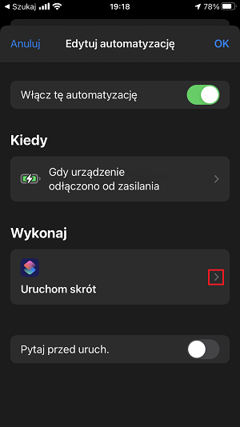
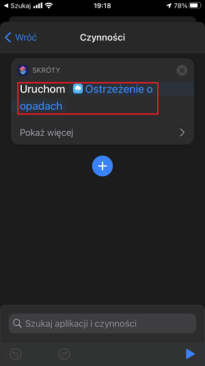

# Ostrzeżenie o opadach
Deszcz lub śnieg cię nie zaskoczą. Gdy rano (lub w ciągu dnia) odłączysz telefon od ładowarki, otrzymasz ostrzeżenie, jeśli w prognozie są opady.

## Wymagania
Aby zainstalować skrót spoza galerii Apple należy mieć włączoną opcję Ustawienia -> Skróty -> Pozwalaj na niezaufane skróty.

Skrót wykorzystuje poniższe uprawnienia: 
1. Usługi lokalizacji - na potrzeby sprawdzenia prognozy dla bieżącej lokalizacji
2. Powiadomienia - na potrzeby wyświetlenia ostrzeżeń

**Uwaga**: istnieje możliwość zmiany skryptu, by zamiast pogody dla bieżącej lokalizacji sprawdzał pogodę w ustalonym miejscu. W przypadku wprowadzenia tej zmiany, uprawnienia lokalizacji nie będą wymagane.

## Instalacja
Instalacja następuje poprzez otwarcie poniższego adresu w urządzeniu z zainstalowaną aplikacją Skróty:
https://www.icloud.com/shortcuts/6b693e98a1594ee69d998ca1e9d35a3c

Aplikacja wyświetli całość kodu do weryfikacji i poprosi o potwierdzenie chęci instalacji.

W kolejnym kroku aplikacja da możliwość dostosowania parametrów działania do własnych potrzeb. Domyślnie skrót sprawdza pogodę w bieżącej lokalizacji i wyświetla ostrzeżenia o opadach, których prawdopodobieństwo przekracza 30%. 

## Automatyzacja
Po zainstalowaniu skrótu należy:
1. Otworzyć kreator nowej automatyzacji (Skróty -> Automatyzacja -> + -> Utwórz automatyzację osobistą -> Ładowarka -> Jest odłączona -> Dalej)
2. Dodać czynność "Uruchom skrót" i wskazać "Ostrzeżenie o opadach"
3. Po przejściu dalej należy odznaczyć opcję "Pytaj przed uruch." i zakończyć kreator wybierając przycisk "OK"

Ekran konfiguracji automatyzacji powinien wyglądać, jak poniżej:

## Listing kodu
Dla dociekliwych załączam zrzut ekranu z treścią skryptu.

