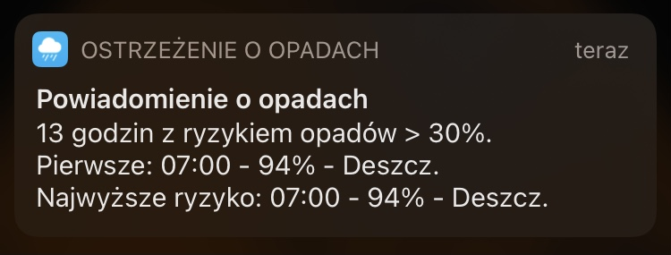

# iOS-Shortcuts
I might publish here selected iOS shortcuts depending on their complexity and reusability.

Currently there is only one. It's localized to Polish language but can be modified after installation.

1. [[PL] Ostrzeżenie o opadach](https://github.com/Czuz/iOS-Shortcuts/blob/main/PL-ostrzezenie_o_opadach/README.md) - Start a day with notification if there is a rain or snow forecast. Verification will be triggered when you grab your phone from charger.

